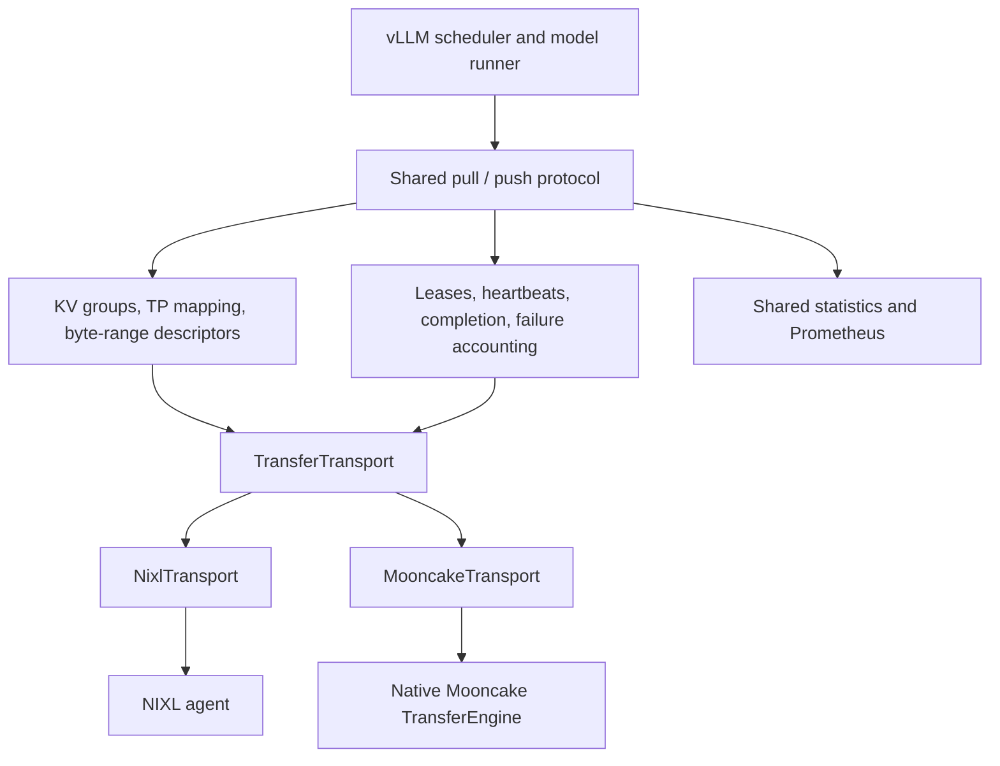

# Transfer-engine-agnostic P/D connectors

`P2pPullConnector` and `P2pPushConnector` implement the P/D protocol once, with
NIXL and native Mooncake as interchangeable transfer implementations. The
runtime is extracted from the NIXL connector, including its scheduler, worker,
metadata, descriptor geometry, completion accounting and metrics.

## Boundaries



The transport only knows local/remote byte ranges, opaque peer metadata and
opaque notification payloads. It does not know requests, layers, attention
backends, HMA groups or tensor-parallel ranks. Changes to GQA replication,
Mamba/GDN convolution slicing, prefix hits or scheduler lifetimes belong above
this boundary and apply to both engines.

| Responsibility | Shared protocol | Engine adapter |
| --- | --- | --- |
| Scheduling and request/block ownership | Pull and push state machines | None |
| HMA, sliding windows, SSM and heterogeneous TP | Group mapping and descriptor generation | Transfer the selected byte ranges |
| Handshake | Model/layout/mode/engine compatibility and topology | Export/connect opaque engine metadata |
| Completion and leases | Expected sender/consumer counts, heartbeat payloads, expiry | Transfer completion and byte notifications |
| Metrics | Aggregation, histograms, failure/expiry counters | Normalize native telemetry to seconds and bytes |
| Memory | KV allocation and buffer lifetime | Register/unregister and prepare descriptors |

A planner regression test is shared across engines. A backend contract test
covers byte movement, completion visibility and resource lifetime. Engine
adapters are loaded only when a worker constructs its transport; selecting
Mooncake does not require installing NIXL.

## Transport contract

The interface lives in `p2p/transport.py`:

1. Register `(address, byte_length, device_id)` memory regions and export peer
   metadata. Connect remote peers using their opaque metadata.
2. Prepare persistent local and remote descriptor tables. Local tables use
   `peer=None`; remote tables use the identifier returned by `connect_peer`.
3. Create a READ or WRITE using indices into the two tables. Local descriptors
   are always first: READ fills local memory, WRITE reads local memory. Paired
   descriptors have equal byte lengths. Creating a handle does not submit work.
4. `submit` starts work; `poll` must return without waiting for data movement.
   A completion notification must never precede visibility of the transferred
   data. Requests own the underlying buffers until protocol completion.
5. Collect normalized telemetry, then release transfer handles. Descriptors and
   registrations outlive every transfer that uses them. Stop submissions and
   drain transfers before releasing registrations at shutdown.

`FAILED` permits request-level recovery only when memory access has stopped.
`FatalTransferError` indicates that the engine cannot establish that guarantee;
this error propagates out of the shared progress loop so the worker is restarted
instead of recycling potentially active KV memory.

NIXL uses prepared native descriptor lists and native completion/notification
operations. Its existing backend options and microsecond-to-second telemetry
conversion remain in `NixlTransport`.

Mooncake executes native `batch_transfer_sync_read` / `batch_transfer_sync_write`
in a bounded worker pool. Submission and polling do not wait for those calls.
A separate ZMQ I/O thread delivers acknowledged binary notifications, including
heartbeats and push registrations. All sockets belong to that thread. A native
batch failure is fatal because Mooncake's timeout path can return without a
quiescence guarantee. A notification failure after successful data movement is
recoverable. Standalone notification sends wait for acknowledgement up to
`notification_timeout`; data-copy polling remains nonblocking.

Out-of-tree transports can implement `TransferTransport` and call
`register_transport(name, module_path, class_name)` during plugin initialization
in each process. The class advertises READ/WRITE capabilities through
`operations`; unsupported directions fail before the engine is constructed.

## Configuration and migration

For native Mooncake pull, configure both instances with this connector. Use
`kv_producer` on prefill and `kv_consumer` on decode:

```json
{
  "kv_connector": "P2pPullConnector",
  "kv_role": "kv_consumer",
  "kv_buffer_device": "cuda",
  "kv_connector_extra_config": {
    "transfer_engine": "mooncake",
    "mooncake_protocol": "rdma"
  }
}
```

For push, change the connector on both instances to `P2pPushConnector`. For NIXL,
set `transfer_engine` to `nixl`. This default preserves existing NIXL deployments.

| Connector name | Direction | Default engine |
| --- | --- | --- |
| `P2pConnector`, `P2pPullConnector` | READ / pull | NIXL |
| `P2pPushConnector` | WRITE / push | NIXL |
| `NixlConnector`, `NixlPullConnector` | READ / pull | NIXL |
| `NixlPushConnector` | WRITE / push | NIXL |
| `MooncakePullConnector` | READ / pull | Mooncake |
| `MooncakePushConnector` | WRITE / push | Mooncake |

The NIXL names and import paths remain compatibility aliases. The default NIXL
compatibility hash retains its existing factors and wire version. Different
engines or transfer directions are rejected during handshake; engine-agnostic
implementation does not imply NIXL-to-Mooncake wire interoperability.

The existing `MooncakeConnector` retains its original implementation and
bootstrap protocol. Migrate both endpoints and the proxy together. Use the
[shared pull proxy](../../examples/disaggregated/disaggregated_serving/disagg_proxy_demo.py)
or [shared push proxy](../../examples/disaggregated/disaggregated_serving/disagg_proxy_pushconnector_demo.py)
with the new connectors, rather than the legacy Mooncake proxy.

Shared `kv_connector_extra_config` options include `side_channel_host` and
`side_channel_port`, falling back to the existing `VLLM_NIXL_SIDE_CHANNEL_*`
variables. The side-channel address must be reachable from the peer. Mooncake
also accepts `mooncake_hostname` (defaults to the worker IP), `mooncake_protocol`
(default `rdma`), `device_name` (default empty), `num_workers` (default 10), and
`notification_timeout` in seconds (default 5). Native Mooncake RPC and control
ports are dynamically allocated and advertised in peer metadata. Deploy peers
on the same trusted network used for vLLM's other distributed communication.
Mooncake requires a build exposing native batch READ and WRITE operations.

## Feature scope and metrics

The shared runtime includes both directions, heterogeneous TP and block sizes,
HMA/SSM and sliding-window descriptor planning, prefix-cache accounting, host
transfer buffers, heterogeneous layout postprocessing, bidirectional pull
transfer, lease heartbeats, peer eviction and the existing push PP protocol.
These reuse the existing NIXL implementation and retain its configuration guards;
sharing code does not expand its supported model/layout/topology combinations.
In particular, push DCP and hybrid SSM DCP remain unsupported, and generic HMA
load-failure reporting still has the existing group-zero limitation. Layerwise
transfer is not implemented by this runtime.

Both backends publish these metrics, with `ENGINE` set to `nixl` or `mooncake`:

- `vllm:ENGINE_xfer_time_seconds`
- `vllm:ENGINE_post_time_seconds`
- `vllm:ENGINE_bytes_transferred`
- `vllm:ENGINE_num_descriptors`
- `vllm:ENGINE_num_failed_transfers_total`
- `vllm:ENGINE_num_failed_notifications_total`
- `vllm:ENGINE_num_kv_expired_reqs_total`

The first four are histograms; the remainder are counters. NIXL metric names
are unchanged. Mooncake measures native batch duration and transferred bytes;
post time is zero because its synchronous API does not report a separate
posting duration. Fatal errors require worker recovery and may terminate the
worker before its last metrics batch is published.

## Validation

`test_p2p_transport.py` checks real byte copies through an in-process native API
stand-in, notification ordering, nonblocking polling, unsafe failures and actual
Prometheus samples. Existing NIXL suites exercise the shared protocol and HMA
geometry through the compatibility aliases.

Hardware validation is also required: run pull and push with each native
engine, compare deterministic completions against a colocated baseline, run the
existing [P/D accuracy evaluation](../../tests/v1/kv_connector/nixl_integration/test_accuracy.py),
and cover prefix hits, concurrent requests, GQA TP replication boundaries and
hybrid GDN/Mamba models. Mock transport tests cannot establish RDMA/GPU memory
visibility, model accuracy or performance equivalence.
